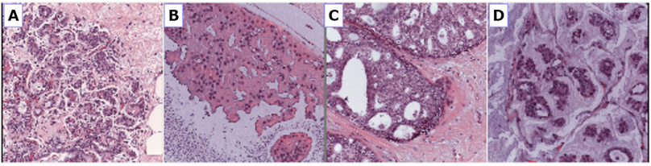
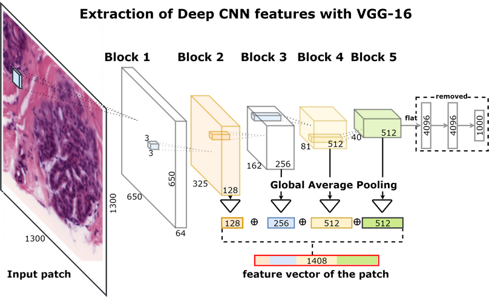
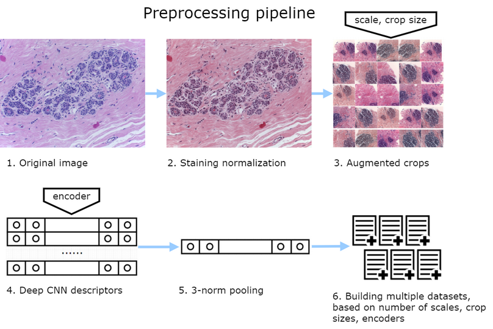
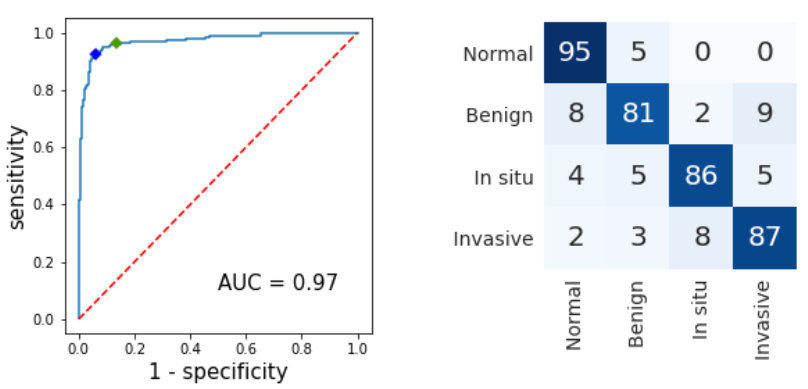

==========================
ICIAR 2018 Grand Challenge
==========================

Our solution for `ICIAR 2018 Grand Challenge on Breast Cancer Histology Images`_.

In this work, we propose a simple and effective method for the classification of H&E stained histological breast cancer images in the situation of very small training data (few hundred samples). To increase the robustness of the classifier we use strong data augmentation and deep convolutional features extracted at different scales with publicly available CNNs pretrained on ImageNet. On top of it, we apply highly accurate and prone to overfitting implementation of the gradient boosting algorithm. Unlike some previous works, we purposely avoid training neural networks on this amount of data to prevent suboptimal generalization.

.. contents::

Team members
------------
`Alexander Rakhlin`_, `Alexey Shvets`_, `Vladimir Iglovikov`_, `Alexandr A. Kalinin`_

Reference Paper
---------------
Rakhlin, A., Shvets, A., Iglovikov, V., Kalinin, A.: Deep Convolutional Neural Networks for Breast Cancer Histology Image Analysis. arXiv:1802.00752 [cs.CV], `link <https://arxiv.org/abs/1802.00752>`_

If you find this work useful for your publications, please consider citing::

    @article{rakhlin2018deep,
      title={Deep Convolutional Neural Networks for Breast Cancer Histology Image Analysis},
      author={Rakhlin, Alexander and Shvets, Alexey and Iglovikov, Vladimir and Kalinin, Alexandr A},
      journal={arXiv preprint arXiv:1802.00752},
      year={2018}
    }

Overview
--------
Breast cancer is one of the main causes of cancer death worldwide. Early diagnostics significantly increases the chances of correct treatment and survival, but this process is tedious and often leads to a disagreement between pathologists. Computer-aided diagnosis systems showed potential for improving the diagnostic accuracy. In this challenge, we developed the computational approach based on deep convolution neural networks for breast cancer histology image classification. Hematoxylin and eosin stained breast histology microscopy image dataset is provided as a part of the ICIAR Grand Challenge on Breast Cancer Histology Images. Our approach utilizes several deep neural network architectures and gradient boosted trees classifier. For 4-class classification task, we report 87.2% accuracy. For 2-class classification task to detect carcinomas we report 93.8% accuracy, AUC 97.3%, and sensitivity/specificity 96.5/88.0% at the high-sensitivity operating point. To our knowledge, this approach outperforms other common methods in automated histopathological image classification.

Data
----
The image dataset consists of 400 H&E stain images (2048 |times| 1536 pixels). All the images are digitized with the same acquisition conditions, with a magnification of 200 |times| and pixel size of 0.42 |micro| |times| 0.42 |micro|. Each image is labeled with one of the four balanced classes: ``normal``, ``benign``, `in situ`, and ``invasive``, where class is defined as a predominant cancer type in the image. The image-wise annotation was performed by two medical experts. The goal of the challenge is to provide an automatic classification of each input image.

    Examples of microscopic biopsy images in the dataset: (A) normal; (B) benign; (C) in situ carcinoma; and (D) invasive carcinoma

Method
------
Very deep CNN architectures that contain millions of parameters such as ``VGG``, ``Inception`` and ``ResNet`` have achieved the state-of-the-art results in many computer vision tasks. However, the limited size of the dataset (400 images of 4 classes) poses a significant challenge for the training of a deep learning model. We purposely avoid training neural networks on this small amount of data to prevent suboptimal generalization. Instead, we employ 2-stage process using deep convolutional feature representation.

In the first stage deep CNNs, trained on large and general datasets like ImageNet (10M images, 20K classes), are used for unsupervised feature extraction. This unsupervised dimensionality reduction step mitigates the risk of overfitting in the next stage of supervised learning.

In the second stage we use LightGBM_ as a fast, distributed, high performance implementation of gradient boosted trees for supervised classification. Gradient boosting models are being extensively used in machine learning due to their speed, accuracy, and robustness against overfitting.

Pre-processing and feature extraction
-------------------------------------
To bring the microscopy images into a common space, we normalize the amount of H&E stained on the tissue. For each image, we perform 50 random color augmentations. From every image we extract 20 random crops and encode them into 20 descriptors. Then, the set of 20 descriptors is combined into a single descriptor. For features extraction, we use standard pre-trained ResNet-50, InceptionV3 and VGG-16 networks from Keras_ distribution.

Training
--------
For cross-validation we split the data into 10 stratified folds to preserve class distribution. Augmentations increase the size of the dataset |times| 300 (2 patch sizes |times| 3 encoders |times| 50 color/affine augmentations). To prevent information leakage, all descriptors of an image must be contained in the same fold. For each combination of the encoder, crop size and scale we train 10 gradient boosting models with 10-fold cross-validation. Furthermore, we recycle each dataset 5 times with different random seeds in LightGBM adding augmentation on the model level. For the test data, we similarly extract 50 descriptors for each image and use them with all models trained for particular patch size and encoder. The predictions are averaged over all augmentations and models.

Results
-------
To validate the approach we use 10-fold stratified cross-validation. For 2-class non-carcinomas (``normal`` and ``benign``) vs. carcinomas (`in situ` and ``invasive``) classification accuracy was 93.8 |plusmn| 2.3%, the area under the ROC curve was 0.973. Out of 200 carcinomas cases only 9 `in situ` and 5 ``invasive`` were missed. For 4-class classification accuracy averaged across all folds was 87.2 |plusmn| 2.6%.

|

    Left: non-carcinoma vs. carcinoma classification, ROC. 96.5% sensitivity at high sensitivity setpoint (green) |br|
    Right: Confusion matrix, without normalization. Vertical axis - ground truth, horizontal - predictions.

|

============== ==== ==== ==== ==== ==== ==== ==== ==== ==== ==== ==== ====
model          f 1  f 2  f 3  f 4  f 5  f 6  f 7  f 8  f 9  f 10 mean std
============== ==== ==== ==== ==== ==== ==== ==== ==== ==== ==== ==== ====
ResNet-400     92.0 77.5 86.5 87.5 79.5 84.0 85.0 83.0 84.0 82.5 84.2 4.2
ResNet-650     91.0 77.5 86.0 89.5 81.0 74.0 85.5 83.0 84.5 82.5 83.5 5.2
VGG-400        87.5 83.0 81.5 84.0 84.0 82.5 80.5 82.0 87.5 83.0 83.6 2.9
VGG-650        89.5 85.5 78.5 85.0 81.0 78.0 81.5 85.5 89.0 80.5 83.4 4.4
Inception-400  93.0 86.0 71.5 92.0 85.0 84.5 82.5 79.0 79.5 76.5 83.0 6.5
Inception-650  91.0 84.5 73.5 90.0 84.0 81.0 82.0 84.5 78.0 77.0 82.5 5.5
std (models)   1.8  3.5  5.7  2.8  2.0  3.7  1.8  2.1  3.9  2.7  3.0
Model fusion   92.5 82.5 87.5 87.5 87.5 90.0 85.0 87.5 87.5 85.0 87.2 2.6
============== ==== ==== ==== ==== ==== ==== ==== ==== ==== ==== ==== ====

`Accuracy (%) and standard deviation for 4-class classification evaluated over 10 folds via cross-validation.` |br| `Results for the blended model is in the bottom. Model name represented as (CNN)-(crop size).`

Dependencies
------------
* Python 3
* Keras_ and Theano_ libraries. We did not test with ``Tensorflow`` backend, however it should work too.
* LightGBM_ package.
* Standard scientific Python stack: ``NumPy, Pandas, SciPy, scikit-learn``.
* Other libraries: ``tqdm, six``

How to run
----------
For command line options use ``-h, --help``. If you use default directory structure, you can stick with default command line options. Default directory structure is:

::

 └── ICIAR2018
     ├── submission
     ├── data
     │   ├── train
     │   │   ├── Benign
     │   │   └── ......
     │   ├── test
     │   └── preprocessed
     │       ├── train
     │       │   ├── Inception0.5-400
     │       │   └── ................
     │       └── test
     │           ├── Inception-0.5-400
     │           └── .................
     ├── models
     │   ├── LGBMs
     │   │   ├── Inception
     │   │   └── .........
     │   └── CNNs
     └── predictions
         ├── Inception
         └── .........

You can preprocess the data independently, or use downloaded features. In the former case place the competition microscopy images into ``data\train|test`` directories. Please note the competition rules disallow us to redistribute the data.

1. Download feature files, trained models, and individual folded predictions and skip to 4::

    python download_models.py

Downloaded LightGBM models are being unpacked in ``./models/LGBMs``, CNN models - in ``./models/CNNs`` directories. We provide CNN models just for reference: Keras loads them with its own distribution. Preprocessed features reside in ``./data/preprocessed/train|test`` subdirectories. Crossvalidated predictions reside in ``./predictions`` subdirs. Alternatively, you can skip this step and extract features and train models yourself.

2. To extract features run this. You can skip this step if you are using preprocessed features::

    python feature_extractor.py --images <directory/containing/images/> --features <directory/to/store/features/>

By default preprocessed feature files are contained in directory ``data/preprocessed/[test|train]/model_name/``.

3. To train LightGBM models using cross-validation and to generate predictions for all models, crop sizes, seeds, augmentations and folds run this. You can skip this step if you are using LightGBM models we provided::

    python train_lgbm.py

4. To combine predictions across all models, seeds and augmentations, and crossvalidate across all folds run::

    python crossvalidate_blending.py

In this step you can use predictions pre-saved in step 3 during training (or provided with our data). Or you can have LightGBM models generate predictions anew with command line option ``--predict``. The latter increases running time, but does not affect result.

5. To generate solution::

    python submission.py --features <directory/to/store/features/> --submission <path/to/submission.csv>

.. _`Keras`: https://github.com/fchollet/keras/
.. _`Theano`: http://deeplearning.net/software/theano/
.. _`LightGBM`: https://lightgbm.readthedocs.io/en/latest/
.. _`Alexander Rakhlin`: https://www.linkedin.com/in/alrakhlin/
.. _`Alexey Shvets`: https://www.linkedin.com/in/shvetsiya/
.. _`Vladimir Iglovikov`: https://www.linkedin.com/in/iglovikov/
.. _`Alexandr A. Kalinin`: https://alxndrkalinin.github.io/
.. _`ICIAR 2018 Grand Challenge on Breast Cancer Histology Images`: https://grand-challenge.org/site/ICIAR2018-Challenge/
.. |br| raw:: html

    

.. |plusmn| raw:: html

   &plusmn

.. |times| raw:: html

   &times

.. |micro| raw:: html

   &microm
